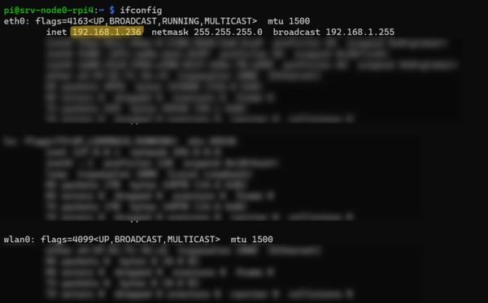
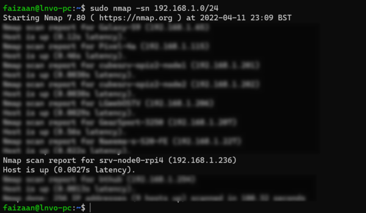

## Setting Up the Server Nodes
- [Setting Up the Server Nodes](#setting-up-the-server-nodes)
  - [Prepare Storage Devices](#prepare-storage-devices)
    - [SD Cards](#sd-cards)
    - [SSD/HDD](#ssdhdd)
  - [Connecting Main Components](#connecting-main-components)
  - [Installing and Setting Up an Operating System (OS)](#installing-and-setting-up-an-operating-system-os)
    - [Installing an OS](#installing-an-os)
      - [Raspberry Pi 4](#raspberry-pi-4)
      - [Orange Pi Zero 2](#orange-pi-zero-2)
    - [SSH](#ssh)
      - [Finding a local SSH server IP address](#finding-a-local-ssh-server-ip-address)
      - [Remote login via SSH](#remote-login-via-ssh)
    - [Updating Firmware and Drivers](#updating-firmware-and-drivers)
      - [Orange Pi Zero 2 update sources](#orange-pi-zero-2-update-sources)
    - [Static IP](#static-ip)
    - [Avahi](#avahi)
      - [Installing Avahi](#installing-avahi)
      - [Editing Configuration Files](#editing-configuration-files)
  - [Setting a Firewall](#setting-a-firewall)
  - [Mounting a USB Drive](#mounting-a-usb-drive)
  - [Installing Software](#installing-software)
    - [Docker](#docker)
    - [NFS](#nfs)

### Prepare Storage Devices
devices may have unallocated space,   
how to format

#### SD Cards
ideally empty, 16GB+, start FAT32

#### SSD/HDD
why Ext4?   
Format drive

### Connecting Main Components

### Installing and Setting Up an Operating System (OS)
#### Installing an OS
##### Raspberry Pi 4
For the raspberry pi there are many operating systems (OS's) to choose from ...
To keep things relatively simple, I will be using a stock Raspberry Pi OS, more specifically Raspberry Pi OS Lite (64-bit).

There are many guides online for installing the OS, so I will not be going into detail about installing the OS.   
My recommendation is to use the stock [Raspberry Pi Imager](https://www.raspberrypi.com/software/), this allows for setting up the server name, pre-setup of Wi-Fi and activating the SSH server when writing the image.  
Just make sure you select the required choices in Imager's settings.

<p align="center">
  
</p>

The manual headless setup for running an SSH server at boot are shown in the Orange Pi Zero 2 set up.
> A headless server is one without any peripherals. (No Mouse, Keyboard or Display)

##### Orange Pi Zero 2
For the Orange Pi Zero 2, I will be using the Ubuntu server 20.04 image provided by the manufacturer.   
use Balena Etcher or other (Imager, Rufus)  
add empty ssh file  
To connect to Wi-Fi   

#### SSH
It is possible to work directly on the server by connecting a display (via HDMI) and keyboard (via USB), however, in practice, servers are usually accessed remotely via the **Secure Shell Protocol** (**SSH**).   
In order to connect this way a device requires a local network connection and the SSH server to be running.   
The SSH server should be running on first boot, provided that the necessary steps were followed during installation.
> It is possible to connect to a server on another local network (someone else's router/internet connection), however, this requires significantly more setup and security.

##### Finding a local SSH server IP address
In order to SSH into our server, we first need to know the local IP address of our server, it will usually be something like this: ***192.168.X.YYY***  
We need to determine the values of ***X*** and ***YYY***.

 ***If you are already connected to the device with a display and keyboard***:  
As you are already connected to the device you can simply run a command to determine the local IP address.
Simply run:
```
ifconfig
```
The output should be something similar to this:

<p align="center">
  
</p>

The highlighted part shows the local IP address of the device.

Notice how my IP is listed under the `eth0` interface as I am connected via ethernet, if you are connected via Wi-Fi, the IP address will be shown under the `wlan0` interface.


***If you are connected to the same local network***:   
We first need to determine ***X***. If you are on Linux, MacOS or WSL (Windows Subsystem for Linux) you can use `ifconfig` again to determine your devices local IP address, the output should be similar to the picture above, make a note of ***X***.

> There are a plethora of ways to actually do this, most likely you canfind out yur local IP address in the settings of your OS.  (Search: "find my device ip address")

Now using the ***X*** value we can search through our local network. (***X*** will most likely be ***1***)  
There are tools available to scan through your local network's IP addresses.  
For Linux, MacOS or WSL (Windows Subsystem for Linux) you can use a command line tool called **nmap**,  
I will not got into detail how to install nmap as there will be plenty of guides already available.   
Simply open a terminal and enter the command below. (remember to substitute your own ***X*** value)  
```
sudo nmap -sn 192.168.1.0/24
```
Give the program a moment to search and you should get an output as follows:

Hopefully, you should see the IP address of your device to SSH into.

<p align="center">
  
</p>

As you can see, my device shows up with an IP address of `192.168.1.236`, the name of the device is *srv-node0-rpi4*, this is because I gave my Raspberry Pi that name when writing the image to the SD card using the Raspberry Pi Imager.
> The default name of a raspberry pi is usually: *raspberrypi*

##### Remote login via SSH
```
ssh <username>@<host_ip_address>
```

```
ssh pi@192.168.1.236
```

```
ssh orangepi@192.168.1.XXX
```

#### Updating Firmware and Drivers
```
sudo apt update
```

```
sudo apt upgrade
```

`sudo reboot now` or `sudo shutdown -r now`
##### Orange Pi Zero 2 update sources


#### Static IP

#### Avahi
Avahi is program that runs on the server nodes to ...

The stock Raspberry Pi OS comes with Avahi preinstalled and running, the node's hostname was already set when writing the image to the SD card via the Raspberry Pi Imager, and as this is the name Avahi uses, no more setup is needed to broadcast a name.  
If you would like to change the broadcasted hostname, follow the steps below for the Orange Pi Zero 2 Avahi setup.

##### Installing Avahi

```
sudo apt install avahi
```

##### Editing Configuration Files


### Setting a Firewall


### Mounting a USB Drive


### Installing Software

#### Docker

#### NFS

