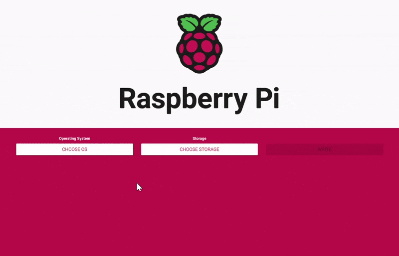
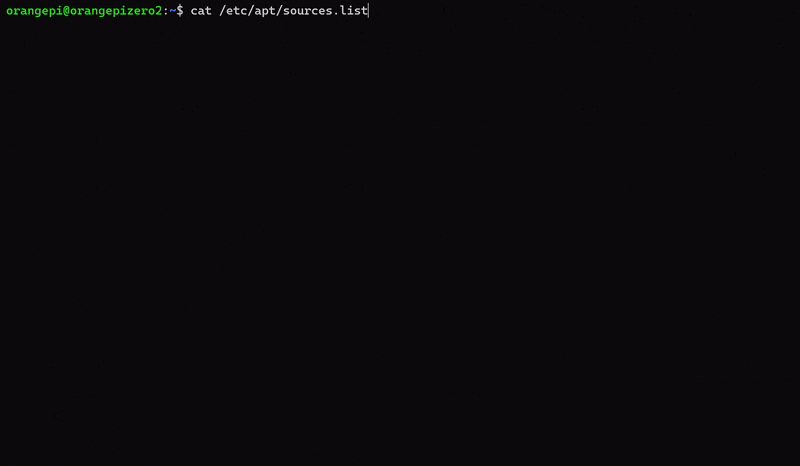

## Setting Up the Server Nodes
<!-- Topics in this section:
Storage file systems, partitions, 
Operating systems, 64-bit, 32-bit, 
SSH, 
IP, IP addresses, Static IP, DNS
Linux, apt, command line, mounting volumes, systemd  -->

<!-- Objective: Server node(s) with:
 * an operating system installed
 * operating system updated
 * an ssh server running with access
 * a static ip address
 * a custom hostname
 * permanently mounted drive via USB -->

<!-- TOC:start -->
- [Setting Up the Server Nodes](#setting-up-the-server-nodes)
  - [Target Diagram](#target-diagram)
  - [Prepare Storage Devices](#prepare-storage-devices)
    - [SD Cards](#sd-cards)
    - [SSD/HDD](#ssdhdd)
  - [Connecting Main Components](#connecting-main-components)
  - [Installing and Setting Up an Operating System (OS)](#installing-and-setting-up-an-operating-system-os)
    - [Installing an OS](#installing-an-os)
      - [Raspberry Pi 4](#raspberry-pi-4)
        - [Why Raspberry Pi OS?](#why-raspberry-pi-os)
        - [Why Lite?](#why-lite)
        - [Why 64-bit?](#why-64-bit)
      - [Orange Pi Zero 2](#orange-pi-zero-2)
        - [Manually enable SSH on first boot](#manually-enable-ssh-on-first-boot)
    - [SSH](#ssh)
      - [Finding a local SSH server IP address](#finding-a-local-ssh-server-ip-address)
        - [Directly connected to server](#directly-connected-to-server)
        - [Connected to same local network as server](#connected-to-same-local-network-as-server)
      - [Remote login via SSH](#remote-login-via-ssh)
    - [Updating Firmware and Software](#updating-firmware-and-software)
      - [Orange Pi Zero 2 update sources](#orange-pi-zero-2-update-sources)
        - [Backup/Copy a file using the terminal](#backupcopy-a-file-using-the-terminal)
        - [Editing a text file using the terminal](#editing-a-text-file-using-the-terminal)
    - [Static IP](#static-ip)
      - [Choosing a static IP address](#choosing-a-static-ip-address)
      - [Changing Subnet Mask](#changing-subnet-mask)
        - [What is a subnet mask?](#what-is-a-subnet-mask)
      - [Setting a static IP address](#setting-a-static-ip-address)
        - [Raspberry Pi 4](#raspberry-pi-4-1)
        - [Orange Pi Zero 2](#orange-pi-zero-2-1)
    - [Manually set server hostname](#manually-set-server-hostname)
  - [Mounting a USB Drive](#mounting-a-usb-drive)
    - [Mount once](#mount-once)
    - [Automatically Mount on boot](#automatically-mount-on-boot)

<!-- TOC:end -->

### Target Diagram

<p align="center">
  
</p>

### Prepare Storage Devices
Before the storage devices are connected and used, they must be prepared, this includes the SD card(s) that the server(s) will boot from and the SATA SSD (Solid State Drive) which will be used for persistent network data storage.

To prepare the storage for use, the devices must be formatted, there are many tools available to do this and most operating systems have this functionality built in.   
I will be using [Minitool Partition Wizard](https://www.partitionwizard.com/free-partition-manager.html) (Windows only), however there are many others (free and paid) available to use for your operating system.   
I am using a dedicated partition manager as devices may have unallocated space or be completely unallocated and operating systems do not always allow the user to claim/reclaim this space.
> As always, back up any data you wish to keep, formatting will wipe the storage device.

#### SD Cards
SD cards are reformatted when an OS is written to them, however it is still a good idea to format before writing as this will make it easier for your writing tool to write the OS.   
I recommend clearing all partitions and then (optional) creating a single FAT32 partition.   
**Note**: If the card has no partitions (All space unallocated) it may not show up in your OS's file explorer, but it should show up for selection in the OS writing tool.

<p align="center">
  
</p>

> An OS boot SD card should ideally be Class 10 or faster and 16GB+

#### SSD/HDD
The SSD will also have all partitions removed (if any exist).   
As no OS will be written to the SSD, partitions will have to be made in order to actually use it.   
I will be formatting the SSD to have a single partition, only this time the file system will not be FAT32, it will be Ext4.   
This is because Ext4 works great with linux. There are [other file systems](https://www.howtogeek.com/howto/33552/htg-explains-which-linux-file-system-should-you-choose/) that work great, however Ext4 is a very good start point for 
> The SD card will also be mostly formatted to Ext4 by the writer. 

When formatted you will notice that there will be a small percentage of disk space used, this is normal as [there is overhead](https://askubuntu.com/questions/131516/new-ext4-partition-and-used-space) to using Ext4.


### Connecting Main Components

### Installing and Setting Up an Operating System (OS)
#### Installing an OS
##### Raspberry Pi 4
For the Raspberry Pi there are many operating systems (OS's) to choose from. I considered DietPi and Ubuntu, but to keep things relatively simple, I will be using a stock Raspberry Pi OS, more specifically Raspberry Pi OS Lite (64-bit).
> DietPi is a stripped down version of the Raspberry Pi OS (same kernel), uses less RAM, bloatware optional.

###### Why Raspberry Pi OS?
Raspberry Pi OS is well developed and fully featured, it is the top choice for our device and there is little reason to choose another.
As it is designed to run on our device there is plenty of support for the hardware (GPIO and interfaces) making it very stable for experimenting.
###### Why Lite?
As we are creating a server that will only be accessed via the command line, there is no need for a desktop environment, this will save processing and memory resources.
###### Why 64-bit?
The Raspberry Pi I am using will have less than 4GB of RAM (2GB), however, it is still a good idea to use the 64-bit OS. The CPU has a 64-bit architecture, so it was designed to run 64-bit programs, there are also some [performance and stability advantages](https://www.phoronix.com/scan.php?page=article&item=raspberrypi-32bit-64bit&num=2) to using the 64-bit OS on the the Raspberry Pi 4.
> 32-bit operating systems can only address <3.5GB of system memory (RAM), 64-bit can address about [16 exabytes](https://www.geeksforgeeks.org/difference-32-bit-64-bit-operating-systems/).

There are many [guides online for installing the OS](https://www.raspberrypi.com/documentation/computers/getting-started.html), so I will not be going into detail about installing the OS.   
My recommendation is to use the stock [Raspberry Pi Imager](https://www.raspberrypi.com/software/).
This allows for many options that save a lot of configuration time:
* Setting the hostname (optional, recommended)
  * If you will be connecting to many nodes, this will make it easier to differntiate when searching for the correct IP address ([Finding a local SSH server IP address](#finding-a-local-ssh-server-ip-address)).
  * This will also initialise the DNS host name automatically [Avahi](#avahi).
* Pre setup of Wi-Fi (only if needed)
  * If you will not be connecting via ethernet and cannot connect a keyboard or display (headless), then you can setup the Wi-Fi credentials when installing the OS.
* Easiest way to the SSH server on first boot (optional, recommended)
  * Starting the SSH server on first boot without using a keyboard or screen requires extra setup otherwise as shown in the OS installation of [Orange Pi Zero 2](#orange-pi-zero-2).

> A headless server is one without any peripherals. (No Mouse, Keyboard or Display)

Ensure you select the required choices in Imager's settings.

<p align="center">
  
</p>


##### Orange Pi Zero 2
For the Orange Pi Zero 2, compared to the Raspberry Pi there are not as many OS's available to choose from.   
I will be using the Ubuntu Server Focal 20.04 (kernel 5.13) image provided by the manufacturer.   

The Raspberry Pi Imager can be used to write the image to an SD card again, except this time when choosing an image, be sure to click on "Use custom" and then select your own downloaded image. 

Using the Imager's custom preferences (set hostname, enable ssh .etc) may not work for other OS's, so it is best to not select any of these options. We can instead [manually enable SSH on first boot](#manually-enable-ssh-on-first-boot) as shown below.

Manually setting up Wi-Fi before first boot on Ubuntu can be difficult, and may not always work, I recommend using a wired connection instead.

> There are many other tools available to write and OS image, such as <a href="https://www.balena.io/etcher/" target="_blank">balenaEtcher</a> (Windows, MacOS, Linux)   

[Here](https://techexplorations.com/guides/rpi/begin/ssh-wifi-headless/) is a guide to manual SSH and Wi-FI setup using the Raspberry Pi, the SSH steps are the same for the Orange Pi. The Wi-Fi steps may not work.  

###### Manually enable SSH on first boot
After flashing (writing) the OS to the SD card, do not insert it into to the host, instead reinsert it into your computer, and the SD card should show up in the OS's file explorer, open this drive and view it's folders.   
Only a small partition of the SD card will be mounted to the computer, so the capacity will be smaller than the full SD card

(Windows users): I find getting the SD card partition to show up in windows is inconsistent, even when the SD card is known to be connected, getting the boot partition to mount is very unreliable, consider using Linux or MacOS instead.

In this mounted partition there will be a folder called "`boot`", open this folder.   
To trigger starting the SSH server on boot, the OS looks for an empty file named "`ssh`".   

To create the empty `ssh` file, you can try to create a new file using the explorer (via right-click, new file/new Text Document), the file can be named "`ssh.txt`" or "`ssh`".   
You may need to have admin privileges to make this change.   
Another way is to use the command line, the mounted partition can be accessed using the "open in terminal" function available in most Linux file explorers and MacOS.


You can also directly navigate to the location of the mounted partition (volume) using the `cd` command.   
In Linux mounted volumes usually live in `/media`. You can also use `df -h` to list information on all mounted volumes, this should show the directory of all mounted volumes (`Mounted on`).

<p align="center">
  
</p>

When in the `/boot` directory of the partition, to create the file run:   
```
sudo touch ssh
```
To see if the file is created, use the command `ls`, this should show the files and folders in the directory, there should be an entry called `ssh`.   

<p align="center">
  
</p>


#### SSH
It is possible to work directly on the server by connecting a display (via HDMI) and keyboard (via USB), however, in practice, servers are usually accessed remotely via the **Secure Shell Protocol** (**SSH**).   
In order to connect this way, A host/server requires a local network connection and an SSH server to be running.   
The SSH server should be running on first boot, provided that the necessary steps were followed during installation.
> It is possible to connect to a server on another local network (someone else's router/internet connection), however, this requires significantly more setup and security.

##### Finding a local SSH server IP address

In order to SSH into our server, we first need to know the local IP address of our server, it will usually be something like this: ***192.168.X.YYY***  
We need to determine the values of ***X*** and ***YYY***.

###### Directly connected to server

***If you are already connected to the server with a display and keyboard***:  

As you are already connected to the host you can simply run a command to determine the local IP address.
Simply run:
```
ifconfig
```
The output should be something similar to this:

<p align="center">
  
</p>

The highlighted part shows the local IP address of the device.

Notice how my IP is listed under the `eth0` interface as I am connected via ethernet, if you are connected via Wi-Fi, the IP address will be shown under the `wlan0` interface.

###### Connected to same local network as server

*If you are connected to the same local network*   

***Searching using hostname via local DNS (`nslookup`):***   

Many Linux OS's come with a system called `avahi` preinstalled and running at boot, `avahi` publishes the IP address of the server to the DNS (Domain Name System) sever on the local network router.   

This means that the router of the local network can have an IP address mapped to a domain name.   
As a default, `avahi` broadcasts the server's `hostname` to the DNS server to be associated wth the IP address.   

Both Raspberry Pi OS and Ubuntu 20.04 have `avahi` running at boot.   

To lookup the IP address(es) associated with a domain name, Windows, MacOS and most Linux OS's have a built in tool: `nslookup`.   
*On Windows, I recommend using WSL (Windows Subsystem for Linux) for `nslookup`*   

To use `nslookup` run the following command: (substituting the `hostname` of server you are searching for)   
```
nslookup <server_hostname>
```

As I renamed my Raspberry Pi host name to `srv-node-rpi4` during the OS image write, I use the command: `nslookup srv-node0-rpi4`.   

The default `hostname` for the Raspberry Pi is `raspberry`: `nslookup raspberrypi`   
The default `hostname` for the Orange Pi Zero 2 is `orangepizero2`: `nslookup orangepizero2`   

`nslookup` also returns many addresses associated with a server, including ipv6 addresses (longer, numbers and letters).   

If you have several DNS broadcasting devices with the same `hostname`, `nslookup` will return multiple IP addresses for the domain name.

<p align="center">
  
</p>

***Searching through an IP address range (`nmap`):***   

We first need to determine ***X***. If you are on Linux, MacOS or WSL (Windows Subsystem for Linux) you can use `ifconfig` again to determine your computer's local IP address, the output should be similar to the picture above, make a note of ***X***.

> There are a plethora of ways to actually do this, most likely you can find out your local IP address in the settings of your OS.   (Search: "find my computer's local ip address")

Now using the ***X*** value we can search through our local network. (***X*** will most likely be ***1***)  
There are tools available to scan through your local network's IP addresses.  
For Linux, MacOS or WSL (Windows Subsystem for Linux) you can use a command line tool called **nmap**,  
I will not got into detail how to install nmap as there will be plenty of guides already available.   
Simply open a terminal and enter the command below. (remember to substitute your own ***X*** value)  
```
sudo nmap -sn 192.168.1.0/24
```
Give the program a moment to search and you should get an output as follows:

Hopefully, you should see the IP address of your device to SSH into.

<p align="center">
  
</p>

As you can see, my device shows up with an IP address of `192.168.1.236`, the name of the device is *srv-node0-rpi4*, this is because I gave my Raspberry Pi that name when writing the image to the SD card using the Raspberry Pi Imager.
> The default name of a raspberry pi is usually: *raspberrypi*


There are also many applications with a GUI (Graphical User Interface) that offer similar functionality as nmap, such as [Angry IP Scanner](https://angryip.org/).


##### Remote login via SSH
Using the local IP address of our target server, we can now use SSH to login.   
Windows 10, 11, MacOS, and most Linux distributions come with an SSH client pre-installed (most likely OpenSSH). To check, open a terminal and enter `ssh`, there should be a similar output as below:

<p align="center">
  
</p>

> You can also use a terminal emulator with a GUI such as [Putty](https://www.putty.org/)

To remote into a host with an SSH server running, you need the host IP address (as found earlier) and a username of a user on the host, using these, run the command below:
```
ssh <username>@<host_ip_address>
```
The stock Raspberry Pi OS image has a user with the username `pi`, so to access my host, I use the following command:
```
ssh pi@192.168.1.236
```

> You can also use the local DNS domain name of the server to ssh (`ssh pi@srv-node0-rpi4`)

If you successfully reach an SSH server using the correct IP, you will then be shown a key fingerprint and prompted 'Are you sure you want to continue connecting?', enter `yes` to continue.

You will then be prompted to enter your password, If you entered a new password when writing the OS image to the SD card, then use that password to login, If not, then there will be a default password for your chosen OS, for Raspberry Pi OS it is: `raspberry`.

<p align="center">
  
</p>

As shown above, my terminal is now remotely connected as the user `pi` on the host `srv-node0-rpi4`.

To connect to the Orange Pi host I use the default username `orangepi` and the IP address for the host, as shown below.
```
ssh orangepi@192.168.1.YYY
```
The default password for the `orangepi` user is `orangepi`.


#### Updating Firmware and Software
As the server is fresh and not in active use, now is a good time to update the Firmware and Software.   

To update, the servers will need an internet connection.   
If you have remotely connected in via SSH, I'm assuming your server is connected to a router with an internet connection, if you are connected via a closed network, go ahead and connect to the internet.  

My devices are all running Raspberry Pi OS and Ubuntu, these are both Debian based OS's, therefore they have the same package manager (apt) and can be updated using the same commands.

First update the repository sources and determine which packages need updating using the following command:
```
sudo apt update
```
This is a `sudo` command, so may need a password to run. Don't worry, you won't need to enter a password on every time you run a `sudo` command, only the first time after login, or if you haven't in a long while.   
This may take a moment on the first time it is run. When finished, it should display how many packages need updating.

You can then start upgrading the packages using the following command.

```
sudo apt upgrade
```

This will first output which packages need updating and which packages will be removed, followed by a prompt if you would like to proceed with the upgrade.   
You can enter `y` or `Y` and press `enter` to proceed.
> As the `Y` is a capital letter in the options (`Y/n`), this makes it the default selection, so you can just press `enter` without any input and the upgrade will proceed.

After the upgrade is finished, this is a good time to reboot the system, although this is not needed, it is still a good idea as the first update tends to be a heavy one.  
To reboot simply run `sudo reboot` or `sudo shutdown -r now` and the system will reboot.  
If you are connected via SSH you will lose connection, give the host a moment to reboot before attempting to reconnect.   

Once reconnected it is a good idea to remove redundant packages and clean the residual data left behind by the outdated packages, apt is quite good at removing and cleaning this data during an upgrade, but after a heavy initial update, it is best to be thorough.   

Run the command `sudo apt autoremove` followed by `sudo apt autoclean`, there may be nothing to  remove or clean.

Now we have a fresh and updated OS installed on our server(s), to ensure the server is updated run `sudo apt update`, this command should show if any packages need updating.

##### Orange Pi Zero 2 update sources
The stock Ubuntu OS images were compiled in china, so the OS's update sources are set to the sources in china, while this would successfully update the host repositories without issue, it is a good idea to use a more local source of updates.

The URLs for the update sources are defined in a file called "`sources.list`", the file is located in the directory `/etc/apt`.   

To view the contents of this file enter (from any directory):`cat /etc/apt/sources.list`   
This should print out the contents of the file.

<p align="center">
  
</p>

Notice how all the URLs access mirror in china `http://mirrors.tuna.tsinghua.edu.cn/ubuntu-ports/`.   
We will be changing all the URLs to a generic one, we cannot use any update source as not all mirrors support the Orange Pi's system architecture (`arm64`).   
I used `http://ports.ubuntu.com/ubuntu-ports/` as my update source.

> `arm64` is also called `aarch64`, debian based OS's call it `arm64`.

###### Backup/Copy a file using the terminal

Before modifying a config file it is good practice to back it up, if we make a mistake in this config file, it will not prevent access to the host or the directory, so we can make a back up in the same directory copying and renaming the file.

To copy a file in linux, we can use the `cp` command as shown below.
```
cp <filename> <new_filename>
```
To copy a backup of the `sources.list` file:

```
sudo cp /etc/apt/sources.list /etc/apt/sources.list.old
```

I have renamed the file to `sources.list.old`, this allows us to identify the original file.
*`sudo` is used as we are editing root directory (/etc) outside of our user (/home/orangepi)*

<p align="center">
  
</p>

###### Editing a text file using the terminal

Now that the `sources.list` file has been backed up, we can now edit the file, to edit the file we can use a text editor, fortunately most linux OS's come with a few terminal text editors built in, these allow us to edit the file without a GUI (Graphical User Interface).   

I will be using the `nano` editor as it is very easy to use compared to `vi`.

> There are other text editors such as [Vim](https://www.vim.org/) and [Emacs](https://www.gnu.org/software/emacs/)

To open the file using the text editor use the following command.
```
nano /etc/apt/sources.list
```
This will open the file as shown below.

<p align="center">
  
</p>

The warning `[ File '/etc/apt/sources.list' is unwritable ]` shows because we are editing a root file in `/etc` withou root privileges, run the command with `sudo` to actually edit the file. "`sudo nano /etc/apt/sources.list`"   
To exit the editor, use `Ctrl + X`.

Use the keyboard to update the URL to the new source URL, `http://ports.ubuntu.com/ubuntu-ports/`.   

Alternatively copy the text below into the file.
```
deb http://ports.ubuntu.com/ubuntu-ports/ focal main restricted universe multiverse
#deb-src http://ports.ubuntu.com/ubuntu-ports/ focal main restricted universe multiverse

deb http://ports.ubuntu.com/ubuntu-ports/ focal-security main restricted universe multiverse
#deb-src http://ports.ubuntu.com/ubuntu-ports/ focal-security main restricted universe multiverse

deb http://ports.ubuntu.com/ubuntu-ports/ focal-updates main restricted universe multiverse
#deb-src http://ports.ubuntu.com/ubuntu-ports/ focal-updates main restricted universe multiverse

deb http://ports.ubuntu.com/ubuntu-ports/ focal-backports main restricted universe multiverse
#deb-src http://ports.ubuntu.com/ubuntu-ports/ focal-backports main restricted universe multiverse
```

To save the new file, use `Ctrl + S`, if you attempt to exit without saving changes, the editor will prompt you to '`Save modified buffer?`'.

The host will now use the new URLs as update sources, run `sudo apt update`.

<p align="center">
  
</p>

If something does go wrong with the update, the backup (`sources.list.old`) file contains the the original data which can be copied back in.

#### Static IP
When we [found the local IP address](#finding-a-local-ssh-server-ip-address) of our server, that IP address was assigned to to the host by the router dynamically via a protocol called `DHCP`.   
As this is a dynamic IP address, it can also be reassigned to another device, as we will be remotely connecting to our server(s), it is a good idea to give our host(s) a **static IP**.      

A `static IP` is exactly as it sound, an self-assigned IP address that doesn't change, it is "static".   

As we will be accessing/serving a network file server, a static IP is very useful.   

##### Choosing a static IP address

DHCP has a range of IP address the protocol can use for dynamic assignment, this range can vary depending on the router, generally it is between `192.168.1.64` to `192.168.1.253` for home routers.

So it is a good idea to assign an IP address in the range of `192.168.1.2` to `192.168.1.63`. This will keep the IP address from DHCP interfering.   
I recommend using an explanatory IP (`192.168.1.10` for node0, `192.168.1.11` for node1 ...) and also one easy to remember.

You can assign static IP address in other ranges:
```
10.0.0.0     to    10.255.255.255
172.16.0.0   to    172.31.255.255
192.168.0.0  to    192.168.255.255
```
In order to change to an ip address outside of `192.168.1.2` to `192.168.1.253`, there is further setup required, this involves [changing the subnet mask](#changing-subnet-mask) (below) in the router, this is optional as staying within `192.168.1.2` to `192.168.1.253` is perfectly acceptable.
<!-- https://www.lifewire.com/using-static-ip-address-on-private-computer-818404 -->

##### Changing Subnet Mask

*This is completely optional and only required if you wish to set up a static IP address outside of default router range (usually `192.168.1.2` to `192.168.1.253`)*.   
*Actually changing the router's subnet mask involves changing the router's settings and these are different depending on the router's make and model*.

###### What is a subnet mask?

Explaining a subnet mask can be quite complicated, try searching "what is a subnet mask?" and you would find some very complicated answers.   

For my use case, the actual change is quite simple, I will be setting the static IP address of my server(s) in the range of `192.168.2.1` to `192.168.2.253`. Notice how ***X*** (*192.168.**X**.**YYY***) is `2` instead of `1`.
This is to keep the IP addresses of the server away from the IP addresses of other devices connected to the router.   

The default subnet mask of my router is `255.255.255.0`, this allows the router to assign IP addresses in the range of `192.168.1.0` to `192.168.1.254`.   
To allow the router to assign IP addresses with a differing ***X*** (*192.168.**X**.**YYY***), the subnet mask must be changed to `255.255.0.0`.   
To change these settings you must alter the settings of your router.

> Most router's settings are usually accessed by visiting an IP address via an internet browser, usually `192.168.1.254`

<p align="center">
  
</p>

Subnet masks can also be [notated in a different way](https://superuser.com/questions/158291/whats-the-meaning-of-10-0-0-1-24-address-of-my-computer-from-the-ip-addr-com#:~:text=This%20format%2010.0.,total%2032%20bit%20address%20field), such as "`/24`". I changed my subnet mask from `/24` (`255.255.255.0`) to `/16` (`255.255.0.0`).

##### Setting a static IP address

To actually set the static IP address, we need to know a few things first:   
* **Your [new chosen IP address](#choosing-a-static-ip-address).**   
  My chosen IP addresses are: `192.168.2.100` for the first server, `192.168.2.101` for the next, and so on.   
* **The subnet mask of the network in which your IP address will reside in.**
  As I changed ***X*** (*192.168.**X**.**YYY***) to `2`, my subnet mask is `255.255.0.0` or `/16`.   
  If you did not change ***X***, then use `255.255.255.0` or `/24`.
* **Your router’s gateway IP address.**   
  This will most likely be `192.168.1.254`, to double check, run the command `ip r | grep default` on your server, the output should should show the router's gateway IP address for the server after "`default via`".   
  The gateway in the image below is `192.168.1.254`.

  <p align="center">
    
  </p>
  
* **The router’s DNS (Domain Name System) IP address.**  
  This is usually the same as the gateway IP address, to double check, view the config file `/etc/resolv.conf`, by running the command `cat /etc/resolv.conf` on the server, this should show all the DNS servers the server uses. If `nameserver 192.168.1.254` is listed, use this as the DNS IP address.

  <p align="center">
    
  </p>

  You may have other DNS servers listed, such as `8.8.8.8` (Google) or `1.1.1.1` (Cloudflare). However, only use these if an IP address corresponding to your local network (like `192.168.1.254`) is not listed.

###### Raspberry Pi 4
<!-- https://www.makeuseof.com/raspberry-pi-set-static-ip/ -->

To change the static IP address on Raspberry Pi OS, we need to add/change some configuration in the file `/etc/dhcpcd.conf`.   
Open the file using `sudo nano /etc/dhcpcd.conf`.   
The file should contain comments (lines of text after `#`).   
Near the bottom of the file should be a commented section called "`# Example static IP configuration:`", this section should include an example static IP configuration, we can either alter this section and then uncomment it or write some new entries below.   

Add the following text to the file: (substituting your own values)
```
interface <your_connection_interface>
static ip_address=<your_chosen_static_ip_address>/<your_static_ip_address_subnet_mask>
static routers=<your_routers_gateway_ip_address>
static domain_name_servers=<your_routers_dns_server_ip_address>
```
your connection interface will be `eth0` or `wlan0` depending on your method of network connection, Ethernet or Wi-Fi.

My settings for my chosen static IP address:
```
interface eth0
static ip_address=192.168.2.100/16
static routers=192.168.1.254
static domain_name_servers=192.168.1.254 8.8.8.8
```
I am connected via ethernet, so my interface is `eth0`.   
My chosen IP address is `192.168.2.100`.   
As I changed my subnet mask to `255.255.0.0`, I put `16`. (If you did not change it, use `24`)   
My router's gateway is `192.168.1.254`.   
My router's DNS server IP address is `192.168.1.254`. (I have also decided to leave in the Google DNS server IP address `8.8.8.8`)   

Save the file (`Ctrl + S`) and reboot your server (`sudo reboot`).   
When reconnecting, you should use your new chosen IP address.   

###### Orange Pi Zero 2

On the Orange Pi, it is best to use the built in config manager to set the static IP.   
To access the config manger, run the command:
```
sudo orangepi-config
```
This should put you into the config manager, a terminal GUI (Graphical User Interface).   

In the GUI, using the arrow keys, go to: `Network > IP > <Static>`.   
You should see a box for the `Static IP configuration`, enter your chosen IP, your new subnet mask (if not changed, use `/24`), and your router's gateway IP address.   
When your new configuration details have been entered, use the `Tab` key to navigate to `OK` and press `Enter`, this will save the configuration.   
It is likely that you will lose connection at this point so try reconnecting using the new IP address.

<p align="center">
  
</p>

#### Manually set server hostname

It is a good idea to change our server(s) hostname, this is especially useful if several of our servers will be the same model as they will have the same hostname.   
Changing the hostname will allow us to differentiate which server we have actually connected to instead of having to a look up the IP address every time.   

To view your current host name, run:
```
hostname
```
To view more information about he host, run:
```
hostnamectl
```

To change the hostname, use the following command:
```
sudo hostnamectl set-hostname <your_new_hostname>
```

To change my hostname to `server-node1`, I would run:
```
sudo hostnamectl set-hostname server-node1
```

It is also a good idea to change the hostname's in the file `/etc/hosts`.
Using `sudo nano /etc/hosts`, edit the file anywhere you see the original hostname to the new hostname.

Once complete reboot the server (`sudo reboot`).


### Mounting a USB Drive

After connecting a USB drive, it is not automatically accessible, this is because it needs to be mounted.   
When running the command `df -h`, notice that only the OS's file systems are mounted.   

To mount a USB drive on the Raspberry Pi, we must first make a directory for the drive to be mounted on, this is the directory where the files and folders on the external drive will be accessed.   

I will mounting on the directory `/mnt/extdisk`.   
To create this directory, I run:
```
sudo mkdir /mnt/extdisk
```

You must also know the file system type your USB drive has it's partition formatted to, [I formatted my drive to `Ext4`](#ssdhdd).

#### Mount once

To mount once, we need to know the name of the partition on the drive we wish to mount.   
There are many ways to do this, I recommend using `fdisk` as this will allow you to correctly determine which partition you wish to mount by showing the size of the partition.   

To list all available partitions, run:
```
sudo fdisk -l
```

This will show many partitions, look for the one corresponding to the size of the partition you wish to mount. It will usually be at the bottom.   
Note the directory of the desired partition, it will be after `Disk`, most likely something like `/dev/sda1`.

To mount the partition run the following command: (substituting your own partition and mount directory)
```
sudo mount -t <drive_partition_file_system_type> <drive_partition_directory> <host_mount_directory>
```

To mount my USB drive, I run:
```
sudo mount -t ext4 /dev/sda1 /mnt/extdisk
```

My drive is formatted to `Ext4`, so the `<drive_partition_file_system_type>` is `ext4`.   
My USB drive's `<drive_partition_directory>` was found to be `/dev/sda1`.   
I created the `<host_mount_directory>` at `/mnt/extdisk`.   

Running `df -h` should show the USB drive mounted at the created directory, any files r directories created here will be written to the USB drive.

This mount is not permanent, and the USB drive will not stay mounted after a reboot.

#### Automatically Mount on boot

To mount automatically at boot, we need the `UUID` of the USB drive, this can be found running the following command:

```
blkid
```

The result should output the details of many partitions, look for your drive's partition (something like `/dev/sda1`) and note the `UUID`.

We will be using this `UUID` add an entry to the file `/etc/fstab`.   

> It is a good idea to create a backup of this file (`sudo cp /etc/fstab /etc/fstab.old`)

Open the file using `sudo nano /etc/fstab` and add an entry to the bottom of file:
```
UUID=<your_drive_uuid> <host_mount_directory> <drive_partition_file_system_type> defaults,auto,users,rw,nofail 0 0
```

If my drive's `UUID`  is `XXXX-YYYY-ZZZZ-0000-1111`, I would add the entry:
```
UUID=XXXX-YYYY-ZZZZ-0000-1111 /mnt/extdisk ext4 defaults,auto,users,rw,nofail 0 0
```

If the drive is not mounted, test the mount by running `sudo mount -a`.

Try rebooting (`sudo reboot`) and then checking if the drive has automatically mounted using `df -h`.
