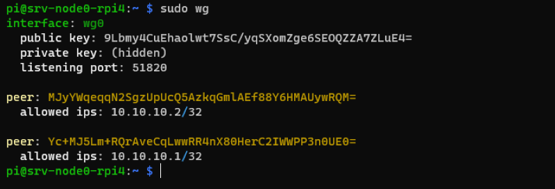
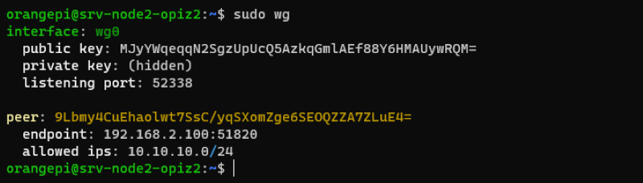

## Setting Up System Architecture

<!-- Objective: Server node(s) with:
 * WireGuard VPN installed
 * VPN server running on manager (node with NFS share)
 * Worker nodes VPN clients connected to VPN server
 * NFS server running on manager node, sharing over VPN server
 * Worker nodes able to connect to NFS share through VPN
 * Docker installed on all nodes
 * All nodes in docker swarm (*optional: within VPN)
 * Portainer stack deployed to swarm
 *  -->

<!-- TOC:start -->

- [Setting Up System Architecture](#setting-up-system-architecture)
  - [Target Diagram](#target-diagram)
  - [VPN (WireGuard)](#vpn-wireguard)
    - [Install WireGuard](#install-wireguard)
    - [Choosing VPN IP address range](#choosing-vpn-ip-address-range)
    - [Setup WireGuard VPN server](#setup-wireguard-vpn-server)
      - [Generating a key pair](#generating-a-key-pair)
      - [Configuring the WireGuard server](#configuring-the-wireguard-server)
      - [Starting up the WireGuard server](#starting-up-the-wireguard-server)
    - [Setup WireGuard VPN client](#setup-wireguard-vpn-client)
      - [Generating a key pair](#generating-a-key-pair-1)
      - [Configuring the WireGuard client(s)](#configuring-the-wireguard-clients)
      - [Starting up the WireGuard client(s)](#starting-up-the-wireguard-clients)
      - [Add WireGuard Client to Server](#add-wireguard-client-to-server)
    - [Connecting and Testing the VPN](#connecting-and-testing-the-vpn)
  - [NFS](#nfs)
    - [Install NFS](#install-nfs)
      - [NFS Server](#nfs-server)
      - [NFS Client(s)](#nfs-clients)
    - [Configure NFS Server](#configure-nfs-server)
    - [Test mount NFS share](#test-mount-nfs-share)
  - [Docker](#docker)
    - [Install Docker](#install-docker)
    - [Create Docker Swarm](#create-docker-swarm)
    - [Deploy Portainer Across Docker Swarm](#deploy-portainer-across-docker-swarm)

<!-- TOC:end -->

### Target Diagram

<p align="center">
  
</p>

### VPN (WireGuard)

<p align="center">
  
</p>

I will be running a WireGuard Server on the manager server node of my cluster, this server will be used exclusively by the server nodes to share data.   

The VPN will not be used to tunnel all data to the local network or the internet, the nodes will be able to connect to the internet to update and download docker images.

The VPN (Virtual Private Network) will encrypt all the data that is shared across the server nodes and provide a degree of separation from the rest of the local network.   

There are two main VPN protocols, OpenVPN and WireGuard, both are considered secure and reliable, OpenVPN being the more mature and more widely available.   
As WireGuard is very performant on the linux kernel, this makes it an excellent choice as the performance overhead will be minimized.    

It is recommended to have a Static IP address on all devices that will be a part of the VPN.   

#### Install WireGuard

<p align="center">
  
</p>

Installing WireGuard should be same on both the Raspberry Pi (Debian) and Orange Pi (Ubuntu).   

To install WireGuard, run:
```
sudo apt install wireguard
```
WireGuard must be installed on all the server nodes.

#### Choosing VPN IP address range

<p align="center">
  
</p>

Devices within the VPN, will have a separate network interface to connect with each other, this separate network interface will have it's own IP address.   
This IP address will not be exposed to the rest of the local network, it will only be used to connect to server nodes within the VPN.   

The block of IP addresses can be within the range below:

```
10.0.0.0     to    10.255.255.255   
172.16.0.0   to    172.31.255.255   
192.168.0.0  to    192.168.255.255   
```

I will be using the block of addresses in the `10.10.10.0/24` range, this is `10.10.10.0` to `10.10.10.254`.   

#### Setup WireGuard VPN server 

<p align="center">
  
</p>

Now that WireGuard has been installed and we have chosen an IP address range, the WireGuard server can be configured and set up.
The WireGuard server will be the central node that all the other nodes communicate with.   
To only permit specific nodes to connect to the server and securely communicate over the WireGuard interface, we must generate a key pair.   
A key pair is a public and private key, this allows data to be encrypted by any node with the public key but only decrypted by nodes with the private key.   
The server will have its own private key that it keeps secret, and a public key the client nodes will use to connect to the server.

##### Generating a key pair
The key pair can be generated on any of the server nodes, for simplicity, the key pair for the the server will be generated on the server node.   

First, generate the ***private key***.   
On the server node, run:
```
wg genkey | sudo tee /etc/wireguard/private.key
```

This command should output the *private key*. ***Make a note of this key***.

The key is saved to `/etc/wireguard/private.key`.   
This key doesn't need to be shared, it is only used by the node to the decrypt secure data, therefore, to keep it safe, it is a good idea to remove all permissions on the file for all users except the root user.   
To do this, run the command:   
```
sudo chmod go= /etc/wireguard/private.key
```
You can still output the private key using `sudo`.   
To view the `private.key` file, run `sudo cat /etc/wireguard/private.key`, this should output the private key.   

Next, we will generate the corresponding public key, this public key is derived from the private key.   

To generate a corresponding public key, run:   
```
sudo cat /etc/wireguard/private.key | wg pubkey | sudo tee /etc/wireguard/public.key
```
This command should output the *public key*. ***Make a note of this key also***.   

##### Configuring the WireGuard server

The WireGuard server can now be configured with the IP address range and the private key.   
We will create a new configuration file to set up the server.   
The `nano` editor can be used to create and edit this configuration file.
I will be creating the configuration within the directory `/etc/wireguard`, the file will be named `wg0.conf`.   

To create the new file in the desired location, run:
```
sudo nano /etc/wireguard/wg0.conf
```
The file isn't created until saved (`Ctrl + S` or exiting and choosing the save option `Ctrl + X`).   

The configuration in this file is as follows:
```
[Interface]
PrivateKey = <base64_encoded_private_key_goes_here>
Address = <server_ip_address>/<subnet_mask>
ListenPort = <vpn_listen_port>
SaveConfig = true
```

If my private key is: `iFpE8J8JZhGoWPMRQvUxoAads+EjEjtiL2I4eE476n0=`, my configuration would be:
```
[Interface]
PrivateKey = iFpE8J8JZhGoWPMRQvUxoAads+EjEjtiL2I4eE476n0=
Address = 10.10.10.0/24
ListenPort = 51820
SaveConfig = true
```
I will be setting my WireGuard server's IP address as `10.10.10.0`, so this is what I put as the `server_ip_address`.   
As the allowed IP address range of the clients is between `10.10.10.0` to `10.10.10.255`, the `subnet_mask` is `24`.   
The default port for WireGuard is `51820`, I will be leaving this as the default.   

Save this configuration file using `Ctrl + S` and exit using `Ctrl + X`.   

##### Starting up the WireGuard server

Now that the WireGuard server is configured, it can be started up.   
The VPN can be configured to start up at boot automatically using `systemctl`.   
To enable `systemctl` to automatically start the WireGuard service, run:   
```
sudo systemctl enable wg-quick@wg0.service
```
If you named the config something other than `wg0`, remember to use that filename in the command.   

> You can create multiple configurations and enable multiple servers all with different keys and IP address ranges.   

The service can now be started:   
```
sudo systemctl start wg-quick@wg0.service
```
You can check to see if the service is running using:   
```
sudo systemctl status wg-quick@wg0.service
```
You should see `active (running)`, in the output (usually green).   

A new interface should be added to `ifconfig` called `wg0`.   

#### Setup WireGuard VPN client

<p align="center">
  
</p>

The setup to make WireGuard run as a client is similar to setting up WireGuard as a a server, the main difference is in the configuration file.

##### Generating a key pair

Every server node (Manager and Worker) will need a key pair.   
The process of [generating the key pair](#generating-a-key-pair) for a client node, is the same as the server nodes.    

For simplicity, I will generate the key pair for the client(s) on the client node(s).   
Remember to make a note of the `private key` and `public key` for each node.

##### Configuring the WireGuard client(s)

Just as when [configuring the WirGuard server](#configuring-the-wireguard-server), on the client(s) (worker server nodes), create a configuration file within the directory `/etc/wireguard`, the file will also be named `wg0.conf`.   

```
sudo nano /etc/wireguard/wg0.conf
```

```
[Interface]
PrivateKey = <base64_encoded_private_key_goes_here>
Address = <client_ip_address>/<subnet_mask>

[Peer]
PublicKey = <base64_encoded_server_public_key_goes_here>
AllowedIPs = <vpn_subnet>
Endpoint = <ip_address_of_vpn_server>:<vpn_server_listen_port>
```

For Worker Node 1 (Client),   
If my `private key` is `____KEY____CLIENT_PRIVATE____KEY____=`, and my server's `public key` is `____KEY____SERVER_PUBLIC____KEY____=`.

My configuration would be:
```
[Interface]
PrivateKey = ____KEY____CLIENT_PRIVATE____KEY____=
Address = 10.10.10.1/24

[Peer]
PublicKey = ____KEY____SERVER_PUBLIC____KEY____=
AllowedIPs = 10.10.10.0/24
Endpoint = 192.168.2.100:51820
```

I will be setting my Worker Node 1 IP address to `10.10.10.1`, so this is what I put as the `client_ip_address`
As the allowed IP address range of the clients is between `10.10.10.0` to `10.10.10.255`, the `subnet_mask` is `24`.   
The `AllowedIPs` is therefore set to `10.10.10.0/24`.   
The `static IP address` of the server is `192.168.2.100`.   
The listen port for the WireGuard server is set to  `51820` (default, set [above](#configuring-the-wireguard-server)).   


Save this configuration file using `Ctrl + S` and exit using `Ctrl + X`.   

##### Starting up the WireGuard client(s)

Starting the WireGuard Client is the same as [starting the WireGuard Server](#starting-up-the-wireguard-server).   

Enable the service to run at boot:
```
sudo systemctl enable wg-quick@wg0.service
```

The service can now be started:   
```
sudo systemctl start wg-quick@wg0.service
```

You can check to see if the service is running using:   
```
sudo systemctl status wg-quick@wg0.service
```
You should see `active (running)`, in the output (usually green).   

A new interface should be added to `ifconfig` called `wg0`.   

##### Add WireGuard Client to Server

The WireGuard services should be running on the Server and Client(s).   

To add the client to the server, a command is run on the WireGuard server node, this command updates the configuration of the server's `wg0.conf` file.   
The command uses the `public key` of the client and the configured VPN IP address of the client.

The command is as follows:   
```
sudo wg set <wireguard_server_interface> peer <client_public_key> allowed-ips <client_VPN_ip_address>
```
If the WireGuard client on Worker Node 1 has the public key `____KEY____CLIENT_PUBLIC____KEY____=`, to add Worker Node 1, I would run the command:   

```
sudo wg set wg0 peer ____KEY____CLIENT_PUBLIC____KEY____= allowed-ips 10.10.10.1
```

My server's WireGuard interface (and config file) is named `wg0`, so this is the value in `<wireguard_server_interface>`.   
The client's (Worker Node 1) VPN IP address is set to `10.10.10.1`, so this is the value in `<client_VPN_ip_address>`.   

All clients can be added using this command.

To see all added clients, run `sudo wg` on the server, this should output all clients added.   

<p align="center">
  
</p>

Running `sudo wg` on the client should only show one `peer`, the server.

<p align="center">
  
</p>

#### Connecting and Testing the VPN

Now that all the configuration is set up, the client and server nodes can connect.   

To test the connection, we can use the built in program `ping`.   

On the WireGuard server attempt to `ping` one of the client VPN IP addresses.   
To `ping` Worker Node 1, I run the command:   

```
ping 10.10.10.1
```

`ping` will continue running until stopped (`Ctrl + C`).

This is expected to fail with with error messages: 

<p align="center">
  
</p>

The top error message (`Destination Host Unreachable`) implies that there may be something wrong with the client.   
However, pinging the clients static IP address should be successful.   
```
ping 192.168.2.101
```

<p align="center">
  
</p>

The reason pinging the client over the VPN fails is because the server only has the clients `public key` and VPN IP address.   
The server needs the client's `static IP address` and VPN `port` in order to connect to the client.   

In order to provide this information to the VPN server, the ***initial connection must be made by the client***.   

On the client, `ping` the server using the server VPN IP address.

```
ping 10.10.10.0
```
This should be successful.   

<p align="center">
  
</p>

The server should now have the required information to maintain a connection to the client.   
Running `sudo wg` on the server should have new client information populated by the initial `handshake`.

<p align="center">
  
</p>

Pinging the client via the server over the VPN should be successful.

<p align="center">
  
</p>

Any client added to the VPN should ping the server for this initial handshake.

### NFS

<p align="center">
  
</p>

#### Install NFS

##### NFS Server

<p align="center">
  
</p>

##### NFS Client(s)

<p align="center">
  
</p>

#### Configure NFS Server

<p align="center">
  
</p>

#### Test mount NFS share

<p align="center">
  
</p>

### Docker

<p align="center">
  
</p>

#### Install Docker

<p align="center">
  
</p>

#### Create Docker Swarm

<p align="center">
  
</p>

#### Deploy Portainer Across Docker Swarm

<p align="center">
  
</p>